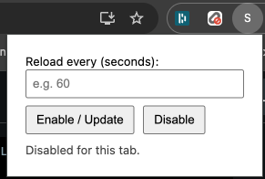

Simple Auto Reloader

A minimal Chrome extension that auto-reloads the current tab at a user-defined interval (in seconds). It stores state per-tab in session storage and shows an "ON" badge when enabled.

Features
- Set a reload interval (in seconds) for the active tab
- Enable/Update and Disable with one click
- Per-tab state (does not affect other tabs)
- Badge indicator shows when auto-reload is active

How it works (high-level)
- The popup (`popup.html`/`popup.js`) lets you enter seconds and toggle the feature.
- The background service worker (`background.js`) stores per-tab state in `chrome.storage.session`, injects `content.js` if needed, and relays configuration messages.
- The content script (`content.js`) schedules a `location.reload()` after the configured interval and reacts to live updates or disable events.

Install (Load Unpacked)
1. Clone or download this repository.
2. Open Chrome and go to `chrome://extensions`.
3. Enable "Developer mode" (top right).
4. Click "Load unpacked" and select the project folder.

Usage
1. Open the page you want to auto-reload.
2. Click the extension icon to open the popup.
3. Enter the interval in seconds (e.g., 60) and click "Enable / Update".
4. The extension badge should show "ON" for that tab. The page will reload after the set interval.
5. To stop auto-reloading for the current tab, click "Disable" in the popup.

Permissions explained
- `tabs`: Query the active tab and set the badge text per tab.
- `storage` (session): Store per-tab interval in `chrome.storage.session` so it resets when the tab closes.
- `scripting`: Inject `content.js` programmatically into the current tab when enabling.
- `host_permissions: <all_urls>`: Allow the content script to run on all sites you might want to auto-reload.

Limitations
- Chrome blocks extensions from injecting scripts into certain pages (e.g., `chrome://*`, Chrome Web Store, PDF viewer). The extension will silently skip those pages; auto-reload cannot be enabled there.
- If a page blocks `location.reload()`, the script falls back to `location.replace(location.href)`.

Privacy
- No analytics, no remote requests, and no data is sent off-device.
- Only the interval value is stored, scoped to the current tab via session storage.

Development
Project structure:
- `manifest.json`: Extension manifest (MV3)
- `background.js`: Service worker for state, messaging, badge updates, and script injection
- `content.js`: Schedules reloads and listens for enable/disable/config updates
- `popup.html` / `popup.js`: Minimal UI to set interval and toggle per tab

Releasing
1. Bump the `version` in `manifest.json`.
2. Verify functionality by loading unpacked and testing enable/disable across tabs.
3. Package via "Pack extension" in `chrome://extensions` or zip the directory for the Chrome Web Store.

Troubleshooting
- Badge not showing "ON": Ensure you clicked "Enable / Update" after entering a positive number of seconds.
- Nothing happens on a page: The page might be restricted (e.g., `chrome://`); try a normal website.
- Interval not sticking across tabs: By design, state is per-tab and cleared when a tab closes.

License
- No explicit license provided. Add one if you plan to distribute.

